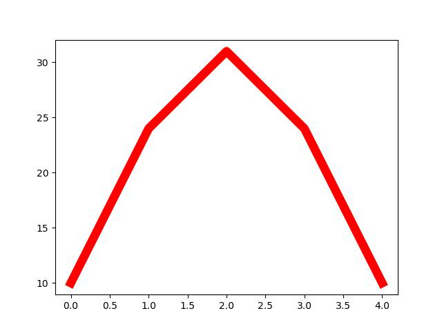

<h2 class="c-project-heading--task">Make your first rainbow stripe</h2>

--- task ---

Run the code to see what happens, then add some data to draw your first red stripe.

--- /task ---

<h2 class="c-project-heading--explainer">A library for colourful art</h2>

You’re going to use a powerful graphing library called *Matplotlib* — but instead of graphs, you’ll make a rainbow! 🌈 

Click *Run*. You’ll just see the axes of a graph. That’s your blank canvas.

Now add some data to create your first red rainbow stripe.

--- code ---
---
language: python
filename: main.py
line_numbers: true
line_number_start: 6
line_highlights: 7-8,14
---
# Rainbow data
sky = [0, 1, 2, 3, 4]
red = [10, 24, 31, 24, 10]

# Make each new colour

# Draw the rainbow
ax.plot(sky, red, color='red', linewidth=9)
--- /code ---

### Tip

Try changing the numbers in `red` — bigger numbers make the arc higher!

You can also change `color='red'` to another colour name like `'green'` or `'pink'`.

### Debugging

- Did you spell `color` the American way (with no “u”)?  
- If nothing appears, check that you wrote `ax.plot(...)` exactly as shown.  
- Make sure your lists use square brackets: `[ ]` not `( )`.

