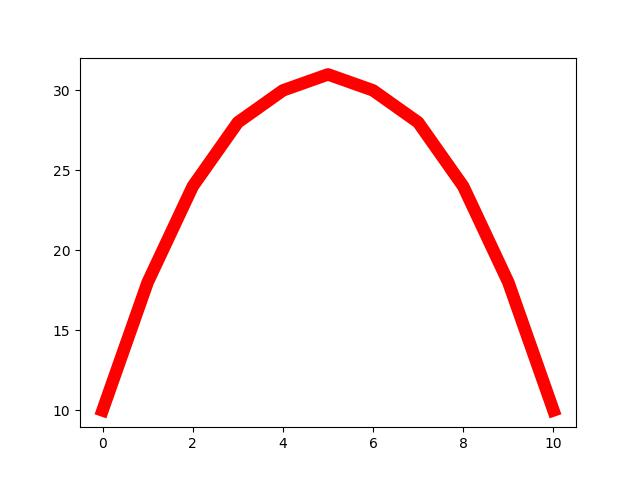

<h2 class="c-project-heading--task">Smooth out the red stripe</h2>

--- task ---

Add more points to your `sky` and `red` lists to make the red stripe look smoother.

--- /task ---

<h2 class="c-project-heading--explainer">More dots = smoother curves</h2>

Right now, your rainbow stripe is made from just a few points, so it looks a bit jagged.

Matplotlib draws lines by joining your points in order:
- `sky` is the *across* numbers (x values)
- `red` is the *up* numbers (y values)

If you add more points, Matplotlib has more places to join up — and your rainbow looks smoother and more rainbow-like.

Replace your `sky` and `red` lists with these longer ones.

--- code ---
---
language: python
filename: main.py
line_numbers: true
line_number_start: 6
line_highlights: 7-8
---
# Rainbow data
sky = [0, 1, 2, 3, 4, 5, 6, 7, 8, 9, 10]
red = [10, 18, 24, 28, 30, 31, 30, 28, 24, 18, 10]

# Make each new colour

# Draw the rainbow
ax.plot(sky, red, color='red', linewidth=9)
--- /code ---

### Tip

If you make the middle numbers bigger, your rainbow gets taller.  
If you make them smaller, your rainbow gets flatter.

Try changing the middle `31` to `35` or `25` and see what happens!

### Debugging

- Your `sky` and `red` lists must be the **same length** (the same number of items).
- If you get an error about sizes or shapes, count the numbers in each list — they should match.

