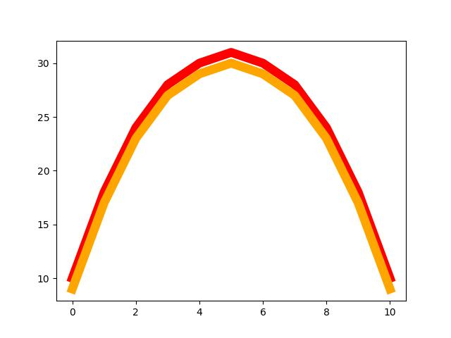

<h2 class="c-project-heading--task">Add the next rainbow colour</h2>

--- task ---

Create a new colour called `orange` by using the red values, then draw it on your graph.

--- /task ---

<h2 class="c-project-heading--explainer">Copy and adjust a list</h2>

Rainbows have stripes that sit just underneath each other.

Instead of typing a whole new list of numbers, you can *reuse* the `red` values and make them slightly smaller.

This line:

`[y - 1 for y in red]`

means:
- Take each number in `red`
- Subtract 1
- Put the new number into a new list

Add the new `orange` list, then draw it.

--- code ---
---
language: python
filename: main.py
line_numbers: true
line_number_start: 6
line_highlights: 11,15
---
# Rainbow data
sky = [0, 1, 2, 3, 4, 5, 6, 7, 8, 9, 10]
red = [10, 18, 24, 28, 30, 31, 30, 28, 24, 18, 10]

# Make each new colour
orange = [y - 1 for y in red]

# Draw the rainbow
ax.plot(sky, red,    color='red',    linewidth=9)
ax.plot(sky, orange, color='orange', linewidth=9)
--- /code ---

### Tip

Try changing `y - 1` to `y - 2`.  

What happens to the gap between the colours?

### Debugging

- Make sure `orange` is spelled the same everywhere.
- Don’t forget to draw it with `ax.plot(...)` — creating the list alone won’t show anything.
- Check your square brackets carefully in `[y - 1 for y in red]`.

